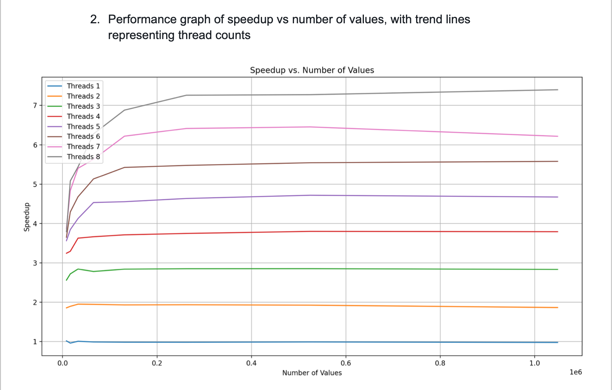
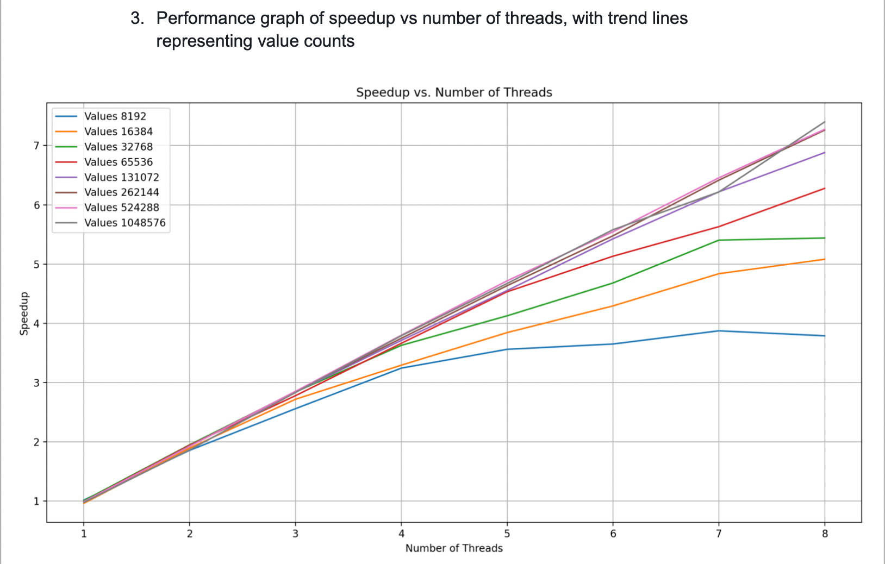

# Synchronized Bitonic Sort

This project implements a synchronized bitonic sort algorithm using C++ threads and a custom Barrier class. The goal is to achieve parallel sorting with improved efficiency and scalability compared to the serial version.

## Project Details

**Objective: Refactor the provided sequential bitonic sort into a parallel version using custom synchronization barriers.**
**Techniques Used: Utilized a mutex and a condition variable to design the barrier for synchronization.**
**Performance Enhancement: Achieved a 7x speedup compared to the serial version by parallelizing the sorting process efficiently.**

### Background
The synchronized bitonic sort algorithm utilizes C++ threads for parallel processing and a custom Barrier class for synchronization. The implementation aims to evenly distribute work across multiple threads, enhancing sorting performance for large datasets.

### Setup
1. **Clone Repository**
   ```bash
   git clone https://github.com/sharonleo-su/synchronized-bitonic-sort.git
   ```

2. **Navigate to Project Directory**
   ```bash
   cd synchronized-bitonic-sort
   ```

3. **Build Project**
   ```bash
   make
   ```

### Running the Project

1. **Build the Project**
   ```bash
   make
   ```

2. **Run with Custom Inputs**
   ```bash
   ./synchronized-bitonic-sort 8192 4
   ```
   Replace `8192` and `4` with your desired element count and thread count for testing different scenarios.

### Performance Metrics





